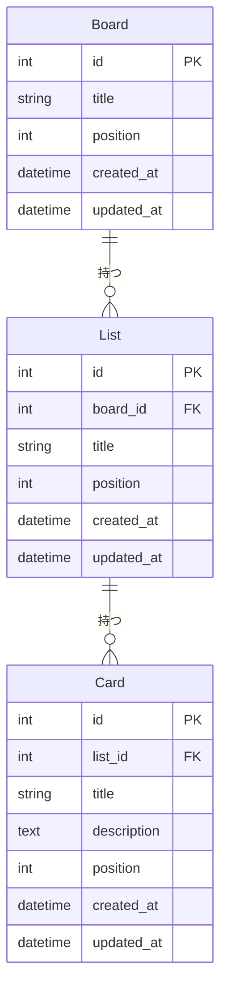

# DB設計書

**バージョン：** 1.0
**作成日：** 2026-04-22
**作成者：** Hoshi251

---

## 改訂履歴

| バージョン | 日付 | 変更内容 |
|-----------|------|---------|
| 1.0 | 2026-04-22 | 初版作成（要件定義書より分離） |

---

## 1. エンティティ一覧

| エンティティ | 説明 |
|-------------|------|
| Board | ボード（最上位の作業空間） |
| List | リスト（ボード内の列） |
| Card | カード（タスクの最小単位） |

---

## 2. ER図

---

## 3. テーブル定義

### 3-1. Board テーブル

| カラム名 | 型 | NULL | 説明 |
|---------|-----|------|------|
| id | INT | NOT NULL | 主キー（自動採番） |
| title | VARCHAR | NOT NULL | ボードのタイトル |
| position | INT | NOT NULL | 一覧での表示順 |
| created_at | DATETIME | NOT NULL | 作成日時 |
| updated_at | DATETIME | NOT NULL | 更新日時 |

### 3-2. List テーブル

| カラム名 | 型 | NULL | 説明 |
|---------|-----|------|------|
| id | INT | NOT NULL | 主キー（自動採番） |
| board_id | INT | NOT NULL | 所属ボードのID（外部キー） |
| title | VARCHAR | NOT NULL | リストのタイトル |
| position | INT | NOT NULL | ボード内での表示順 |
| created_at | DATETIME | NOT NULL | 作成日時 |
| updated_at | DATETIME | NOT NULL | 更新日時 |

### 3-3. Card テーブル

| カラム名 | 型 | NULL | 説明 |
|---------|-----|------|------|
| id | INT | NOT NULL | 主キー（自動採番） |
| list_id | INT | NOT NULL | 所属リストのID（外部キー） |
| title | VARCHAR | NOT NULL | カードのタイトル |
| description | TEXT | NULL | カードのメモ（空欄可） |
| position | INT | NOT NULL | リスト内での表示順 |
| created_at | DATETIME | NOT NULL | 作成日時 |
| updated_at | DATETIME | NOT NULL | 更新日時 |

---

## 4. 設計上のポイント

- **position カラム**：Board・List・Card すべてに `position`（並び順）を持たせる。ドラッグ＆ドロップによる並び替えをデータ側で保持するため。
- **カスケード削除**：Board を削除すると配下の List・Card も削除される。List を削除すると配下の Card も削除される。
- **description の NULL 許容**：Card のメモ欄は未入力を許容する。
- **created_at / updated_at**：全テーブルに持たせる。デバッグや将来の機能拡張（更新日表示など）に備える。
