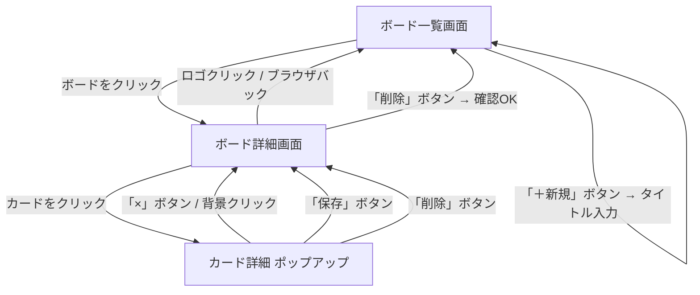

# 画面設計書

**バージョン：** 1.0
**作成日：** 2026-04-22
**作成者：** Hoshi251

---

## 改訂履歴

| バージョン | 日付 | 変更内容 |
|-----------|------|---------|
| 1.0 | 2026-04-22 | 初版作成（要件定義書より分離） |

---

## 1. 画面一覧

| 画面名 | 説明 |
|--------|------|
| ボード一覧画面 | 作成したボードが一覧で表示されるトップページ |
| ボード詳細画面 | リストとカードが並ぶメイン操作画面 |
| カード詳細（ポップアップ） | カードのタイトル・メモを編集するポップアップ |

---

## 2. 画面レイアウト

### 2-1. ボード一覧画面

```
+--------------------------------------------------+
| [TaskManagement]                                  |
+--------------------------------------------------+
| ボード一覧                                        |
|                                                  |
|  +----------+  +----------+  +----------+        |
|  | 仕事     |  | 個人     |  | [+ 新規] |        |
|  |          |  |          |  |          |        |
|  +----------+  +----------+  +----------+        |
|                                                  |
+--------------------------------------------------+
```

**要素説明：**

| 要素 | 種別 | 説明 |
|------|------|------|
| ヘッダー「TaskManagement」 | リンク | クリックでこの画面に戻る |
| ボードカード | クリッカブル | クリックでボード詳細画面へ遷移 |
| 「＋新規」ボタン | ボタン | クリックでタイトル入力欄を表示しボード作成 |

---

### 2-2. ボード詳細画面

```
+--------------------------------------------------+
| [TaskManagement] > 仕事                    [削除] |
+--------------------------------------------------+
|                                                  |
|  +----------+  +----------+  +-----------+       |
|  | TODO     |  | 進行中   |  | 完了      | [+列] |
|  |----------|  |----------|  |-----------|       |
|  | カードA  |  | カードC  |  | カードE   |       |
|  | カードB  |  |          |  |           |       |
|  | [+ 追加] |  | [+ 追加] |  | [+ 追加]  |       |
|  +----------+  +----------+  +-----------+       |
|                                                  |
+--------------------------------------------------+
```

**要素説明：**

| 要素 | 種別 | 説明 |
|------|------|------|
| 「TaskManagement」 | リンク | クリックでボード一覧画面へ戻る |
| 「削除」ボタン | ボタン | 確認ダイアログ表示後、ボードを削除 |
| カード | ドラッグ可能 | 別のリストへドラッグ＆ドロップで移動できる |
| カード | クリッカブル | クリックでカード詳細ポップアップを表示 |
| 「＋追加」ボタン | ボタン | リスト内にカードを追加 |
| 「＋列」ボタン | ボタン | ボードにリストを追加 |

---

### 2-3. カード詳細（ポップアップ）

```
+--------------------------------------------------+
|  +------------------------------------------+   |
|  | [カードタイトル]                      [×] |   |
|  |------------------------------------------|   |
|  | タイトル                                 |   |
|  | [______________________________________] |   |
|  |                                          |   |
|  | メモ                                     |   |
|  | [                                      ] |   |
|  | [                                      ] |   |
|  |                                          |   |
|  |                      [保存]    [削除]    |   |
|  +------------------------------------------+   |
+--------------------------------------------------+
```

**要素説明：**

| 要素 | 種別 | 説明 |
|------|------|------|
| 「×」ボタン | ボタン | 変更を破棄してポップアップを閉じる |
| タイトル入力欄 | テキスト入力 | カードのタイトルを編集 |
| メモ入力欄 | テキストエリア | カードのメモ（複数行）を編集 |
| 「保存」ボタン | ボタン | 変更を保存してポップアップを閉じる |
| 「削除」ボタン | ボタン | カードを削除してポップアップを閉じる |
| 背景（オーバーレイ） | クリッカブル | クリックで変更を破棄して閉じる |

---

## 3. 画面遷移図


