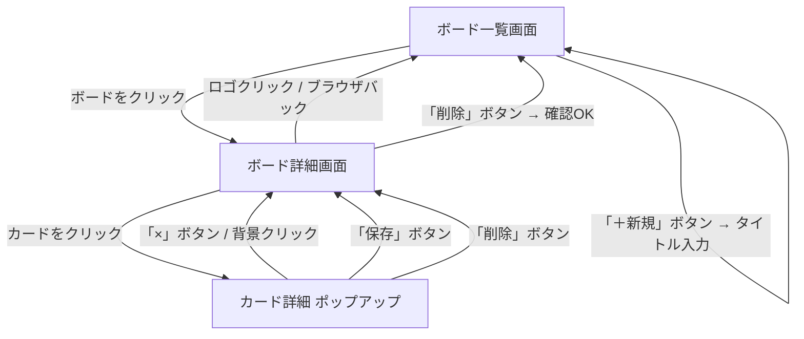
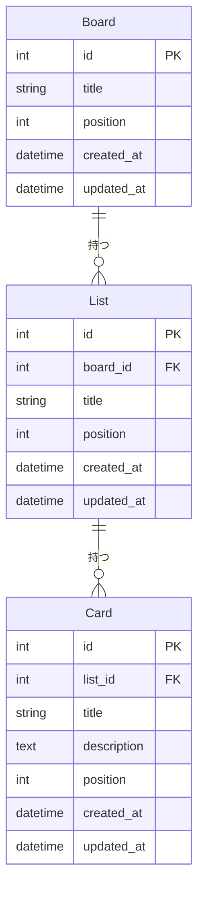

# 要件定義書

**バージョン：** 1.1
**作成日：** 2026-04-22
**作成者：** Hoshi251

---

## 改訂履歴

| バージョン | 日付 | 変更内容 |
|-----------|------|---------|
| 1.0 | 2026-04-22 | 初版作成 |
| 1.1 | 2026-04-22 | 非機能要件・画面設計・ユースケース・ER図・技術選定を追加 |

---

## 1. プロジェクト概要

**アプリ名：** TaskManagement（仮）

### 1-1. 背景

Webアプリ開発のスキルアップを目的とした個人学習プロジェクト。フロントエンド・バックエンド・データベース設計までを一貫して実装することで、実践的な開発経験を積む。

### 1-2. 目的

- フロントエンド開発（UI構築・状態管理）の習得
- バックエンドAPI設計・実装の習得
- データベース設計（テーブル設計・リレーション）の習得
- Trello風のカンバンUIを自力で作ることで、UIコンポーネント設計の理解を深める

### 1-3. 参考サービス

- Trello（https://trello.com）

---

## 2. 対象ユーザー

- 個人利用（自分のみ）
- ログイン・複数人での共有機能はなし

---

## 3. 非機能要件

| # | 項目 | 要件 | 備考 |
|---|------|------|------|
| 1 | パフォーマンス | 通常操作（カード追加・移動など）は1秒以内に反映される | 学習目的のため厳密なSLAは設けない |
| 2 | 対応ブラウザ | Google Chrome（最新版）のみ対応 | クロスブラウザ対応は対象外 |
| 3 | 対応デバイス | PC（デスクトップ）のみ | スマートフォン・タブレット対応は対象外 |
| 4 | セキュリティ | ローカル環境での動作のみのため、認証・認可は不要 | 外部公開する場合は別途検討 |
| 5 | 可用性 | 特に要件なし（学習用ローカル環境） | - |
| 6 | データ保持 | ページを閉じても・再起動してもデータが失われない | 永続化手段は技術選定で決定 |
| 7 | アクセシビリティ | 特に要件なし（学習目的のため） | - |

---

## 4. 画面設計

### 4-1. 画面一覧

| 画面名 | 説明 |
|--------|------|
| ボード一覧画面 | 作成したボードが一覧で表示されるトップページ |
| ボード詳細画面 | リストとカードが並ぶメイン操作画面 |
| カード詳細（ポップアップ） | カードのタイトル・メモを編集するポップアップ |

### 4-2. 画面レイアウト

#### ボード一覧画面

```
+--------------------------------------------------+
| [TaskManagement]                                  |
+--------------------------------------------------+
| ボード一覧                                        |
|                                                  |
|  +----------+  +----------+  +----------+        |
|  | 仕事     |  | 個人     |  | [+ 新規] |        |
|  |          |  |          |  |          |        |
|  +----------+  +----------+  +----------+        |
|                                                  |
+--------------------------------------------------+
```

#### ボード詳細画面

```
+--------------------------------------------------+
| [TaskManagement] > 仕事                    [削除] |
+--------------------------------------------------+
|                                                  |
|  +----------+  +----------+  +-----------+       |
|  | TODO     |  | 進行中   |  | 完了      | [+列] |
|  |----------|  |----------|  |-----------|       |
|  | カードA  |  | カードC  |  | カードE   |       |
|  | カードB  |  |          |  |           |       |
|  | [+ 追加] |  | [+ 追加] |  | [+ 追加]  |       |
|  +----------+  +----------+  +-----------+       |
|                                                  |
+--------------------------------------------------+
```

#### カード詳細（ポップアップ）

```
+--------------------------------------------------+
|  +------------------------------------------+   |
|  | [カードタイトル]                      [×] |   |
|  |------------------------------------------|   |
|  | タイトル                                 |   |
|  | [______________________________________] |   |
|  |                                          |   |
|  | メモ                                     |   |
|  | [                                      ] |   |
|  | [                                      ] |   |
|  |                                          |   |
|  |                      [保存]    [削除]    |   |
|  +------------------------------------------+   |
+--------------------------------------------------+
```

### 4-3. 画面遷移図



---

## 5. 機能一覧・ユースケース

### 5-1. 機能一覧

#### ボード

| # | 機能 | 説明 |
|---|------|------|
| 1 | ボードの作成 | タイトルを入力して新しいボードを作れる |
| 2 | ボードの削除 | 不要なボードを削除できる（配下のリスト・カードも削除） |
| 3 | ボードの切り替え | 複数のボードを切り替えて表示できる |

#### リスト（列）

| # | 機能 | 説明 |
|---|------|------|
| 4 | リストの作成 | ボード内に新しいリスト（列）を追加できる |
| 5 | リストの削除 | 不要なリストを削除できる（配下のカードも削除） |

#### カード（タスク）

| # | 機能 | 説明 |
|---|------|------|
| 6 | カードの作成 | リスト内に新しいカードを追加できる |
| 7 | カードの削除 | 不要なカードを削除できる |
| 8 | カードの移動 | カードを別のリストにドラッグ＆ドロップで移動できる |
| 9 | カードの詳細編集 | カードを開いてタイトルとメモを編集できる |

#### データ保存

| # | 機能 | 説明 |
|---|------|------|
| 10 | データの永続化 | ページを閉じてもデータが消えない |

### 5-2. ユースケース

#### UC-01：ボードを作成する

| 項目 | 内容 |
|------|------|
| アクター | ユーザー |
| 事前条件 | ボード一覧画面を表示している |
| 基本フロー | 1. 「＋新規」ボタンをクリックする<br>2. タイトル入力欄が表示される<br>3. タイトルを入力して確定する<br>4. 新しいボードが一覧に追加される |
| 代替フロー | タイトルが空の場合、作成されない |
| 事後条件 | 新しいボードが保存され、一覧に表示される |

#### UC-02：ボードを削除する

| 項目 | 内容 |
|------|------|
| アクター | ユーザー |
| 事前条件 | ボード詳細画面を表示している |
| 基本フロー | 1. 「削除」ボタンをクリックする<br>2. 確認ダイアログが表示される<br>3. 「OK」をクリックする<br>4. ボードが削除され、一覧画面に戻る |
| 代替フロー | 確認ダイアログで「キャンセル」を押すと削除されない |
| 事後条件 | ボードおよび配下のリスト・カードがすべて削除される |

#### UC-03：リストを作成する

| 項目 | 内容 |
|------|------|
| アクター | ユーザー |
| 事前条件 | ボード詳細画面を表示している |
| 基本フロー | 1. 「＋列」ボタンをクリックする<br>2. タイトル入力欄が表示される<br>3. タイトルを入力して確定する<br>4. 新しいリストがボードの右端に追加される |
| 代替フロー | タイトルが空の場合、作成されない |
| 事後条件 | 新しいリストが保存され、ボード上に表示される |

#### UC-04：カードを作成する

| 項目 | 内容 |
|------|------|
| アクター | ユーザー |
| 事前条件 | ボード詳細画面を表示している |
| 基本フロー | 1. リスト内の「＋追加」ボタンをクリックする<br>2. タイトル入力欄が表示される<br>3. タイトルを入力して確定する<br>4. 新しいカードがリストの末尾に追加される |
| 代替フロー | タイトルが空の場合、作成されない |
| 事後条件 | 新しいカードが保存され、リスト内に表示される |

#### UC-05：カードを移動する

| 項目 | 内容 |
|------|------|
| アクター | ユーザー |
| 事前条件 | ボード詳細画面を表示している |
| 基本フロー | 1. カードをドラッグする<br>2. 別のリスト上にドロップする<br>3. カードが移動先のリストに移動する |
| 代替フロー | 同じリスト内でドロップした場合、並び順が変わる |
| 事後条件 | カードの所属リストおよび並び順が更新・保存される |

#### UC-06：カードを編集する

| 項目 | 内容 |
|------|------|
| アクター | ユーザー |
| 事前条件 | ボード詳細画面を表示している |
| 基本フロー | 1. カードをクリックする<br>2. カード詳細ポップアップが表示される<br>3. タイトルまたはメモを編集する<br>4. 「保存」ボタンをクリックする<br>5. ポップアップが閉じ、内容が反映される |
| 代替フロー | 「×」または背景クリックで変更を破棄して閉じる |
| 事後条件 | 編集内容が保存される |

---

## 6. データ設計（ER図）

### 6-1. エンティティ一覧

| エンティティ | 説明 |
|-------------|------|
| Board | ボード（最上位の作業空間） |
| List | リスト（ボード内の列） |
| Card | カード（タスクの最小単位） |

### 6-2. ER図



### 6-3. 設計上のポイント

- **position カラム**：Board・List・Card すべてに `position`（並び順）を持たせる。ドラッグ＆ドロップによる並び替えをデータ側で保持するため。
- **カスケード削除**：Board を削除すると配下の List・Card も削除される。List を削除すると配下の Card も削除される。
- **description**：Card のメモ欄。空欄も許容する（NULL可）。
- **created_at / updated_at**：全テーブルに持たせる。デバッグ・将来の機能拡張（更新日表示など）に備える。

---

## 7. 技術選定

> ※ 現時点では未決定。データ設計・画面設計を踏まえて別途決定する。

| レイヤー | 候補 | 備考 |
|---------|------|------|
| フロントエンド | 検討中 | - |
| バックエンド | 検討中 | - |
| データ保存 | 検討中 | ローカルストレージ / SQLite / その他 |

---

## 8. 対象外（今回は作らないもの）

- ログイン・ユーザー認証
- 複数人での共有・共同編集
- カードの期限・担当者設定
- 通知機能
- スマートフォン・タブレット対応
- クロスブラウザ対応（Chrome以外）

---

## 9. 未決事項

| # | 項目 | 内容 |
|---|------|------|
| 1 | アプリ名 | 「TaskManagement」のままでよいか |
| 2 | デザイン | 色味・雰囲気のイメージ |
| 3 | 技術選定 | フロントエンド・バックエンド・DB（セクション7で別途決定） |
| 4 | ホスティング | ローカルのみか、外部公開するか |
